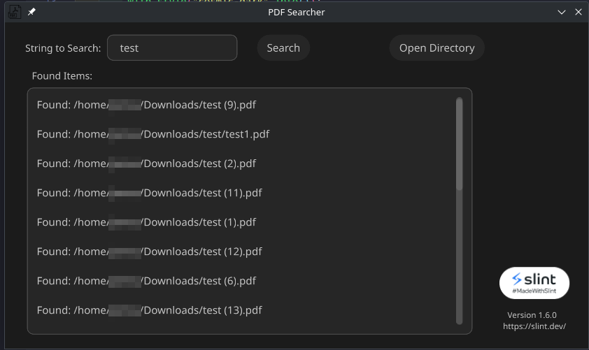

# pdf-parse

A cross platform non multithreaded PDF parser/text parser to search inside PDF documents for certain strings built in Rust.

## Screenshots

## Documentation

1. Click "Open Directory"
2. Type in the string you want to search for
3. Click search
\
 **Warning - This may appear to hang because it is not multithreaded. I am by no means a rust developer I'm just doing it for fun. Any help on this or pull requests would be appreciated, but it does what it's supposed to do.**

## Acknowledgements

 - [Icon](https://www.flaticon.com/free-icons/pdf)
 - [GUI (Slint)](https://slint.dev/)
